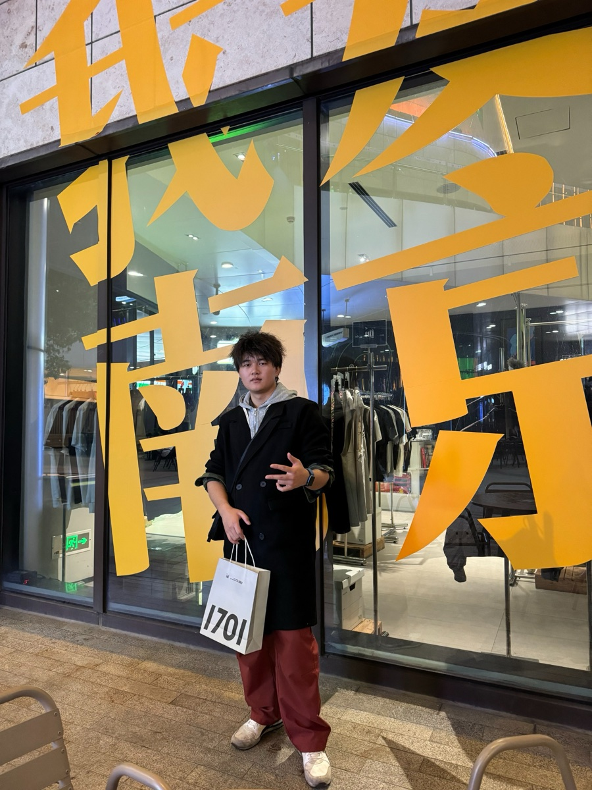

<div align="center">


# 罗宇伦 · Roy Luo

### Hardware · Embedded · Engineering Portfolio

以工程能力为主线，把想法做成样机。

[](https://roylyl.github.io/)
[](https://roylyl.github.io/)
[](index.html)
[](https://github.com/Roylyl/roylyl.github.io/stargazers)
[](https://github.com/Roylyl/roylyl.github.io/forks)
[](https://github.com/Roylyl/roylyl.github.io/commits/main)

[访问网站](https://roylyl.github.io/) · [项目入口](#快速入口) · [本地预览](#本地预览) · [验证](#验证) · [维护指南](#维护指南) · [联系](#联系)

</div>

这是罗宇伦的个人作品集网站。内容围绕硬件开发、嵌入式系统、音频产品和工程验证展开，记录从需求与技术判断，到样机实现、调试与验证的实践过程；音乐与音频设备实践、行业调研和产品思考则呈现工程工作如何连接真实场景。

<p align="center">
  <a href="https://roylyl.github.io/"></a><br>
  <sub>访问线上作品集，查看项目、履历与工程实践。</sub>
</p>

## 快速入口

| 内容 | 入口 | 说明 |
| --- | --- | --- |
| 个人作品集 | [roylyl.github.io](https://roylyl.github.io/) | 个人介绍、能力、实习、项目、理念、音乐与联系方式 |
| 超声波定向扬声器 | [ultrasonic.html](ultrasonic.html) | ESP32 驱动的定向音频第一代 Demo |
| 音享贴 · LENGHE SoundShare | [soundshare.html](soundshare.html) | 跨生态多人蓝牙音频共享硬件原型与产品设计 |
| DeerWebTranslator | [首页项目卡](https://roylyl.github.io/#deer-web-translator) · [源码](https://github.com/Roylyl/DeerWebTranslator) | 原位翻译、阅读状态与取消恢复 |
| MacDuo | [首页项目卡](https://roylyl.github.io/#macduo) · [源码](https://github.com/Roylyl/MacDuo) | 基于 MacBook-Duo 的形态交互实验 |
| 晚渡 · WANDU | [测试产物试听](https://roylyl.github.io/#wandu) · [测试工程](https://github.com/Roylyl/Astra-Music) | Codex GPT-6 Astra 操作 MacBook 上 FL Studio 的 Computer Use 测试，非个人作品 |
| 产品与创业理念 | [首页简短入口](https://roylyl.github.io/#philosophy) · [完整理念](philosophy.html) | 产品判断、交互与学习、技术融合、使用验证、经营与研究、长期方向 |

## 本地预览

主站使用原生 HTML、CSS 和 JavaScript，没有安装依赖或构建步骤。先进入仓库根目录，再用 Python 3 启动静态服务器。

macOS / Linux：

```sh
python3 -m http.server 8000 --bind 127.0.0.1
```

Windows（已安装 Python Launcher）：

```powershell
py -3 -m http.server 8000 --bind 127.0.0.1
```

打开 [本地网站](http://127.0.0.1:8000/)，在终端按 `Ctrl+C` 停止。若端口已被占用，把命令和访问地址中的 `8000` 一起换成其他端口。

使用 HTTP 服务预览，不要直接双击 HTML。`file://` 下的同源判断、跨页面通信和第三方请求可能与正式网站不同。预览服务需以仓库根目录为入口，连续导航按站点根路径识别页面。

## 验证

运行自动测试时另需 Node.js 22 或更新版本，无需执行 `npm install`。在仓库根目录运行：

```sh
node --test tests/particle-input.test.cjs
node --test tests/project-audio.test.cjs
git diff --check
```

[粒子输入回归测试](tests/particle-input.test.cjs) 执行实际粒子脚本，模拟浏览器输入与 WebGL 接口，检查传入渲染器的交互坐标。覆盖普通鼠标、触屏与鼠标并存、主指针为触摸时接入鼠标、合并事件采样、触摸切换、窗口失焦、局部坐标和减少动态效果。它不替代真实浏览器与显卡的渲染验证；仅预览网站不需要 Node.js。

发布前按实际浏览顺序检查：

1. **首页与语言**：切换简、繁、英，检查文字、日期、换行及对应简历下载。
2. **项目导航**：首页 → 超声波 → 音享贴 → 后退两次 → 前进，检查地址、标题、语言、焦点和阅读位置；直接打开带章节锚点的详情页并刷新。
3. **粒子与布局**：桌面、触屏电脑、平板、手机均无横向溢出；鼠标可以接管粒子，手指滚动不受干扰；减少动态效果、切后台和返回页面正常。
4. **菜单与联系方式**：检查手机导航、语言菜单的键盘操作，以及二维码放大、Esc 关闭、账号复制与反馈。
5. **视频与音乐**：检查两段原生视频在中国大陆、其他地区和检测失败时的自动选源；进入详情页后首页视频停止、首页粒子暂停；返回后重新加载播放器，保持自动播放关闭。检查《晚渡》原生试听、暂停、进度与独立音频入口；试听与背景音乐互斥，进入详情页或点击视频时试听暂停，返回后不自动续播。
6. **新增项目**：展开与收起 DeerWebTranslator、MacDuo 的设计说明，核对仓库和源码入口；三语与窄屏下标题、试听控制条和说明均完整可读。
7. **理念阅读**：从首页简短入口进入二级页，逐章检查目录跳转、三语正文和项目链接；核对旧章节锚点仍可访问，以及查看项目后返回理念页的阅读位置。检查桌面、平板和手机代表宽度下的标题、正文与按钮，不把静态检查视为实机验证。

## 网站组成

```text
.
├── index.html                    # 个人主页
├── style.css / script.js         # 主页样式、菜单与二维码交互
├── portfolio-additions.css       # 软件项目与晚渡 Computer Use 测试
├── project-context.css           # 音享贴设计取舍与定向声空间场景
├── ultrasonic.html / .css / .js  # 超声波定向扬声器
├── soundshare.html / .css / .js  # 音享贴 · LENGHE SoundShare
├── philosophy.html / .css / .js  # 产品与创业理念
├── soundshare-particles.js       # 首页与两个项目页共用的 WebGL2 粒子
├── i18n.css / i18n.js            # 三语界面、语言菜单与简历映射
├── background-music.*            # 背景音乐会话与控制
├── continuous-navigation.*       # 详情页嵌入、历史记录与阅读位置
├── regional-video.js            # IP 地区识别与原生视频选源
├── social-controls.css          # 联系方式与二维码区域样式
├── site-accessibility.css        # 焦点、无脚本回退与减少动态效果
├── region-notice.*               # 中国大陆访问提示
├── nav-scroll.js                 # 锚点恢复与详情页移动导航
├── assets/                       # 正式图片、音频、图标与三语简历
├── tests/particle-input.test.cjs # 粒子输入回归测试
├── tests/project-audio.test.cjs  # 试听与背景音乐、详情导航的状态测试
├── kuncode/                      # 独立页面目录
├── lululu/                       # 独立页面目录
└── weijiba/                      # 独立页面目录
```

主站包含主页和三个详情页；后三个独立目录不接入主站的连续导航。它们与 `assets/`、`tests/` 一样属于正式仓库内容。

## 网站行为

- **三语与响应式布局**：主站支持简体中文、繁體中文（香港用语）和 English；导航、卡片、图片与联系方式适配桌面、平板和手机。
- **粒子与玻璃效果**：粒子按实际 `pointerType === 'mouse'` 事件跟随，兼容触屏与鼠标并存的设备；触摸操作保持自动动画。缺少 WebGL2 或浮点颜色缓冲扩展时不启动粒子，系统启用减少动态效果时停止动画。
- **连续导航**：从首页进入详情时，由首页保留背景音乐会话，并同步地址、标题、语言、焦点和阅读位置；详情页也支持独立打开，直接打开或刷新后的音乐状态恢复仍受浏览器播放策略影响。
- **理念阅读**：首页仅保留标题、短摘要与一个阅读入口；完整内容集中在理念页的六个章节，通过页内目录跳读，主要观点始终展开。相关项目链接放在对应章节旁，不在首页重复长文或经营宣言。
- **自动视频选源**：两段视频按 IP 识别结果选择播放源：中国大陆使用哔哩哔哩，其他地区及检测失败时使用 YouTube。直接使用平台原生 iframe，关闭自动播放，不添加自定义缩略图或手动平台选择。
- **音乐与可访问性**：背景音乐初次访问默认静音、按需加载，由访客主动开启。语言菜单支持方向键、Home / End、Tab 和 Esc；手机菜单管理背景交互，二维码与地区提示使用原生弹窗；脚本不可用时正文仍可阅读。
- **测试产物试听**：《晚渡》使用原生 `audio`，`preload="none"`，仅在访客播放后加载。开始试听会关闭背景音乐，重新开启背景音乐会暂停试听；进入项目详情或点击视频时暂停试听，保留进度但不自动恢复。跨域视频内部的实际播放状态由平台控制。

### 本地状态与外部请求

| 用途 | 实现与保存范围 |
| --- | --- |
| 语言偏好 | `localStorage`，用于恢复界面语言与对应简历入口 |
| 访问提示 | `localStorage` 保存上次展示时间，冷却时间为一小时 |
| 背景音乐 | `sessionStorage` 保存当前会话状态 |
| 首页地区检测 | 依次请求 `api.country.is`、`ipapi.co`；仅在页面内共享结果，不持久化地区 |
| 独立详情页访问提示 | 没有共享检测任务时使用 `ipwho.is`；内嵌详情页复用父页任务，不重复查询或弹窗 |
| 视频播放 | 由 YouTube 或哔哩哔哩原生播放器处理 |
| 晚渡试听 | 同源静态文件 `assets/wandu.m4a`，不增加外部播放器或 CDN 请求 |

界面语言不参与视频选源。地区识别与视频的可用性取决于访客网络；表中的存储说明仅涵盖本站脚本，不包含第三方播放器自身的行为。

《晚渡》试听文件来自 [Astra-Music 公开提交 df51e74](https://github.com/Roylyl/Astra-Music/blob/df51e74ce1cf666fce768b21702116cdc9f091d7/%E8%AF%95%E5%90%AC/%E6%99%9A%E6%B8%A1.m4a)，保留原始 AAC / M4A，8,552,981 字节；SHA-256 为 `85efe92b86a6a61134397e60d17505c03ca57868d482c7ba7718907cc587cc00`。FL Studio 工程、MIDI 和生成脚本链接到源仓库，不复制到网站。此音频属于正式展示资产，不是编译产物。

## 维护指南

| 修改内容 | 入口与检查重点 |
| --- | --- |
| 主站文字 | 对应 HTML 与 [i18n.js](i18n.js)；同步三语映射并检查换行。 |
| 产品与创业理念 | 首页 `#philosophy` 的短入口，以及 [philosophy.html](philosophy.html) 的完整正文；同步目录、旧章节锚点和三语映射，区分当前判断、已有成果与后续问题。 |
| 简历 PDF | `assets/` 内三份正式文件，以及 `i18n.js` 的 `resumeAssets`、`resumeVersion` 和 HTML 初始下载链接；核对文件名、页序与语言。 |
| 粒子交互 | [soundshare-particles.js](soundshare-particles.js)；先运行输入回归测试，再检查首页与两个项目页的真实渲染、尺寸和交互。 |
| 视频选源 | [regional-video.js](regional-video.js) 与首页原生 iframe；维持 IP 自动选源、原生嵌入和关闭自动播放。 |
| 联系方式 | [index.html](index.html)、[script.js](script.js)、[social-controls.css](social-controls.css) 与原二维码图片；检查复制、放大和平台入口。 |
| 玻璃卡片 | [style.css](style.css) 的 `.glass` 与 `--module-glass-*`；检查桌面与移动端覆盖，以及滚动入场时的视觉一致性。 |
| 连续导航 | [continuous-navigation.js](continuous-navigation.js)；添加详情页时同步 `detailPages`，并验证直达、章节锚点、浏览器前进与后退。 |

### 更新资源版本

1. 修改 CSS、JavaScript 或固定文件名的素材后，更新**实际引用该资源的页面**中的 `?v=`。不必给无关资源一起改版本。例如粒子脚本由 `index.html`、`soundshare.html`、`ultrasonic.html` 引用，理念页没有加载它。
2. 更新需要通过连续导航加载的详情页 HTML 时，同时更新 `continuous-navigation.js` 中的 `nav-version`，并更新引用该脚本的页面中的脚本版本，让访客拿到新的内嵌 HTML 地址。
3. 发布后从首页进入详情页，并直接打开详情页各检查一次，确认新资源和页面均已生效。

玻璃卡片的入场动画优先放在卡片自身。父容器长期使用 `will-change: opacity` 会影响内部 `backdrop-filter` 的背景采样；当前主页使用卡片级入场和 `will-change: transform`。调整后滚动检查能力、实习与项目模块的一致性。

### 忽略规则

[.gitignore](.gitignore) 统一忽略系统元数据、编辑器本地设置、可选工具依赖、Python 缓存、环境变量覆盖文件，以及根目录的 `tmp/`、`temp/`、缓存和测试报告。`.env.example` 与 `.env.*.example` 模板仍可提交；网站运行本身不需要环境变量配置。

临时预览、截图和检查结果可放在根目录 `tmp/`。正式图片、音频、PDF、测试源码、锁文件与独立页面目录不按类型排除。忽略规则只影响未跟踪文件，不会自动删除或停止跟踪已有文件。

检查某个文件被哪条规则忽略：

```sh
git check-ignore -v tmp/example.png
```

## 发布到 GitHub Pages

仓库可以直接使用分支发布，无需前端构建：

1. 在 GitHub 仓库的 **Settings → Pages → Build and deployment** 中选择 **Deploy from a branch**。
2. 以 `main` 分支的 **/(root)** 作为发布源并保存；这是本仓库当前文件布局适用的配置。
3. 本地验证通过后，将修改提交并推送到配置的发布分支，在仓库 **Actions** 中确认 Pages 部署成功。
4. 打开 [线上网站](https://roylyl.github.io/)，复查页面直达、语言切换、简历下载、视频与移动端菜单。

完整配置见 [GitHub Pages 官方文档](https://docs.github.com/en/pages/getting-started-with-github-pages/configuring-a-publishing-source-for-your-github-pages-site)。本地修改不会自动更新线上网站。

## 关注方向

| 方向 | 关键词 |
| --- | --- |
| 嵌入式开发 | ESP32、ESP-IDF、BLE、A2DP、控制逻辑 |
| 硬件与验证 | PCB 设计、样机组装、信号链检查、硬件调试、系统联调 |
| 音频产品 | 蓝牙音频、定向音频、延迟与同步、跨设备交互 |
| 产品工程 | 用户场景、竞品调研、产品定义、原型推进、项目展示 |

## 简历下载

网站会依据当前界面语言，经由 [i18n.js](i18n.js) 自动指向对应文件。三个 PDF 都是独立的三页文件，并各自保留既有的语言页面顺序。

| 界面语言 | 下载文件 |
| --- | --- |
| 简体中文 | [罗宇伦_简历.pdf](assets/罗宇伦_简历.pdf) |
| 繁體中文（香港用语） | [羅宇倫_履歷.pdf](assets/羅宇倫_履歷.pdf) |
| English | [Roy Luo_Resume.pdf](assets/Roy%20Luo_Resume.pdf) |

## 工程项目

### 超声波定向扬声器

基于 ESP32 推进的定向音频项目，围绕蓝牙音频接收、定向发声链路、样机搭建、硬件调试与系统联调完成第一代 Demo。详情见 [项目页面](ultrasonic.html)。

### 音享贴 · LENGHE SoundShare

面向跨生态多人蓝牙音频共享的硬件原型。首版 PCB 已完成打样、焊接调试及板级功能验证；双 A2DP、多设备同步与延迟调节已纳入系统实现。项目页面会区分已验证内容与仍需继续覆盖的平台兼容性、长期稳定性和产品化细节。详情见 [项目页面](soundshare.html)。

## 实习与行业实践

- **雷鸟创新｜AI 音频算法实习生（2026.09 — 至今）**：参与智能眼镜 AI 音频、语音处理及智能穿戴音频场景的技术调研与方案研究。
- **湖南康通电子股份有限公司｜硬件部实习（2026.08 — 2026.09）**：参与消费级产品前期定义、音视频及智能硬件逆向分析，并协助算法与功能测试。
- **深圳科创学院｜职能部门实习 · 市场调研（2026.01 — 2026.02）**：调研消费电子产品、竞品和用户场景，整理产品信息与阶段性结论。

完整描述见 [主页的实习经历](https://roylyl.github.io/#experience) 与上方三语简历。

## 联系

- GitHub：[@Roylyl](https://github.com/Roylyl)
- 邮箱：[L3092105572@gmail.com](mailto:L3092105572@gmail.com)
- 其他社交平台与二维码：见网站主页联系区域

## 版权与第三方内容

本仓库当前未提供开源许可证。除另有说明外，代码、文字、视频、简历、图片和其他原创内容由罗宇伦 Roy Luo 保留所有权利；未经书面许可，不得复制、修改、重新发布或用于商业用途。

背景音乐《你离开了南京，从此没有人和我说话》仅用于个人作品集的非商业展示与页面体验演示。本人不主张拥有该音乐作品、录音制品或相关素材的著作权及其他权利，相关权利归原作者、表演者、录音制作者及其他合法权利人所有；此处不构成版权许可或对第三方的再授权。

页面中的 YouTube、哔哩哔哩、GitHub、Instagram、微信、抖音、WhatsApp、Microsoft、Visual Studio Code 等名称、商标、嵌入内容及服务归各自权利人所有；相关引用仅用于识别、链接或展示服务，不表示存在隶属、授权、赞助或官方合作关系。

如相关权利人认为网站内容或素材侵犯其合法权益，请通过上方邮箱联系；核实权利信息后，将及时停止使用并移除相关内容。

© Roy Luo. All rights reserved.
